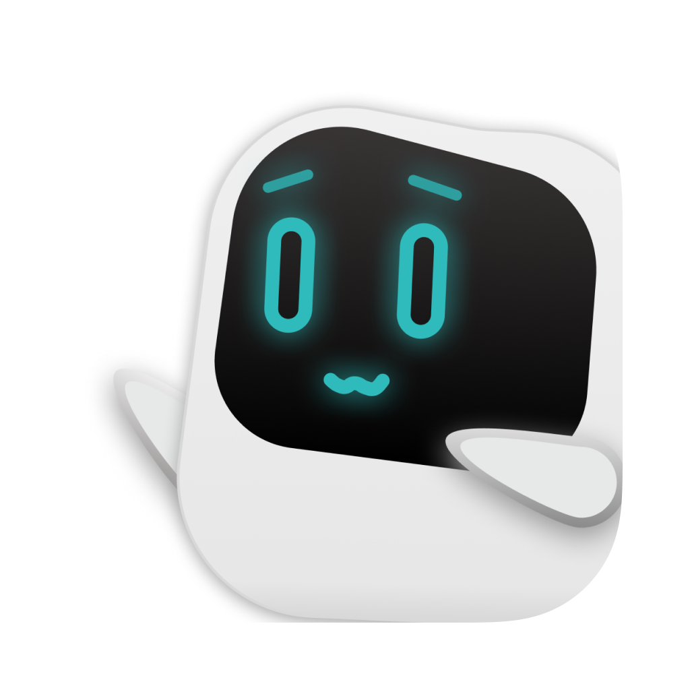

[English](./README.md) | [日本語](./README.ja.md) | [中文](./README.zh.md) | [한국어](./README.ko.md)

# Wait For Me

自分だけのコレクションを作成して、楽しみましょう。

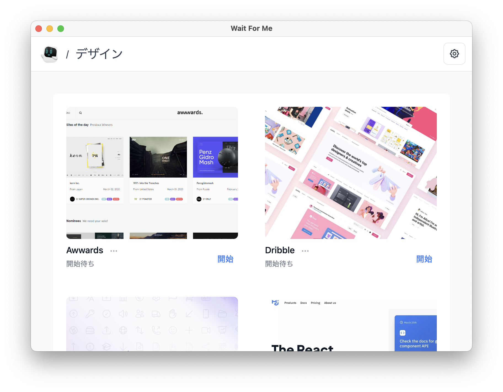

🧱 _このプロジェクトはまだ開発途中です。アプリが大幅に変更される可能性があります。_

## 機能

- 自分だけの個人コレクションを作成
- リンクやカスタム画像を追加
- 映画やドラマのウォッチリストを作成

その他にも多数！

## ダウンロード

### Mac

<a href="#">
    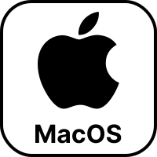
</a>

`近日公開！`

### Windows

<a href="#">
    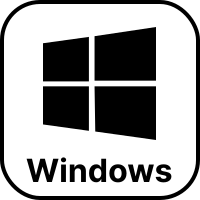
</a>
<a href="#">
    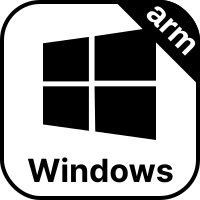
</a>

`近日公開！`

### Linux

<a href="#">
    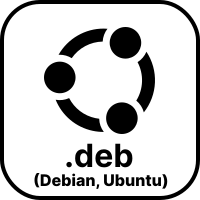
</a>
<a href="#">
    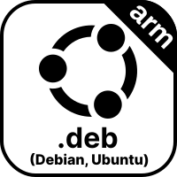
</a>
<a href="#">
    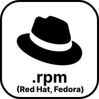
</a>
<a href="#">
    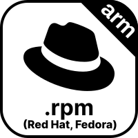
</a>

`近日公開！`

## スクリーンショット

様々なコレクションの作成

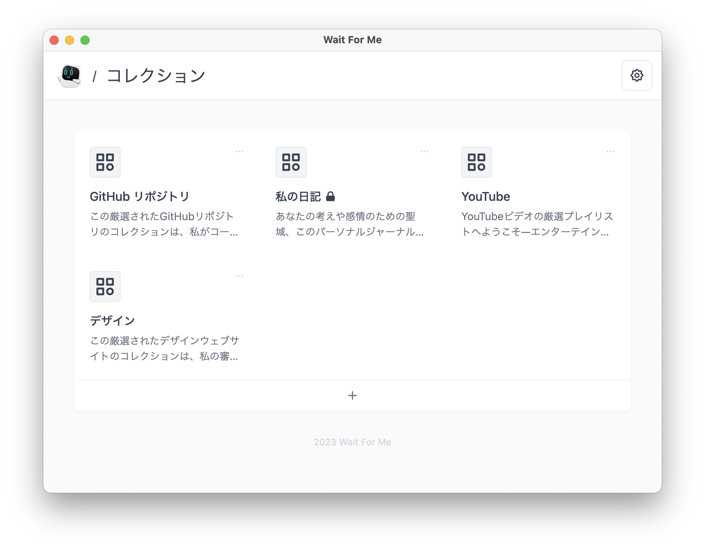

ロック機能でコレクションを保護

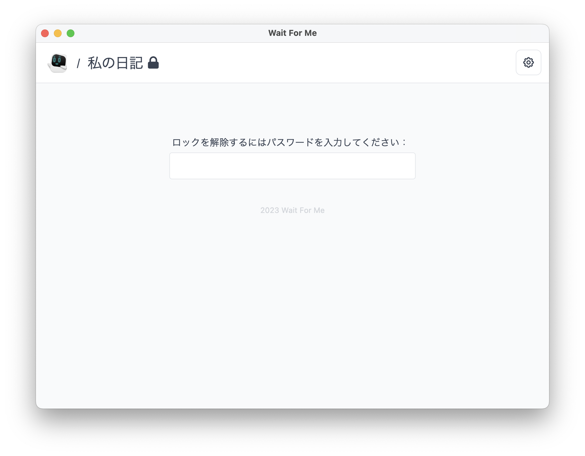

動画のウォッチリストにも

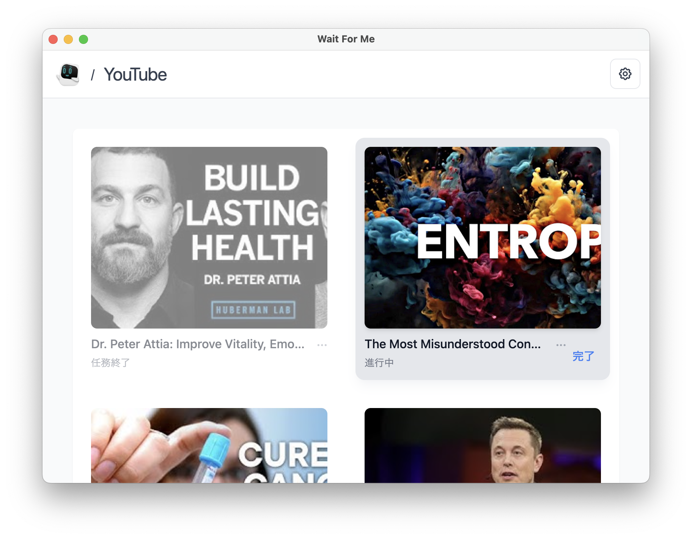

## 🧑‍💻 その他のアプリ

こちらから:

- [Our World](https://ourworld.center/ja/apps) (公式ウェブサイト)
