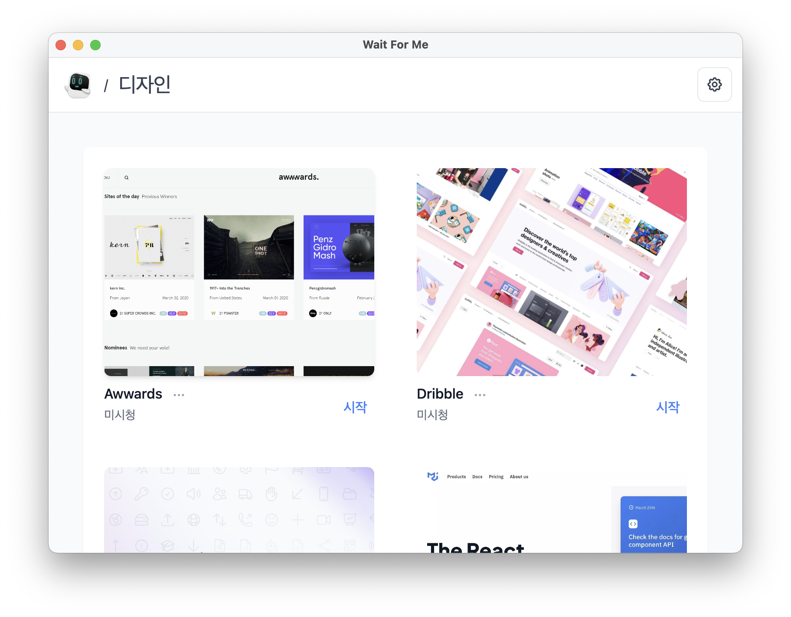
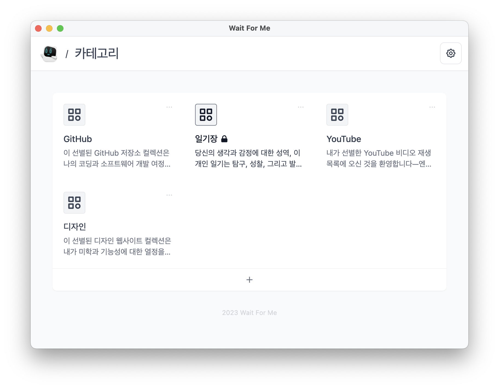
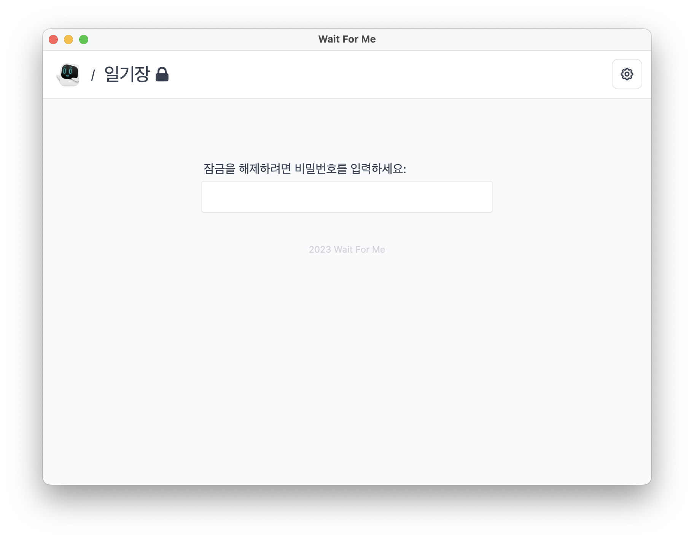
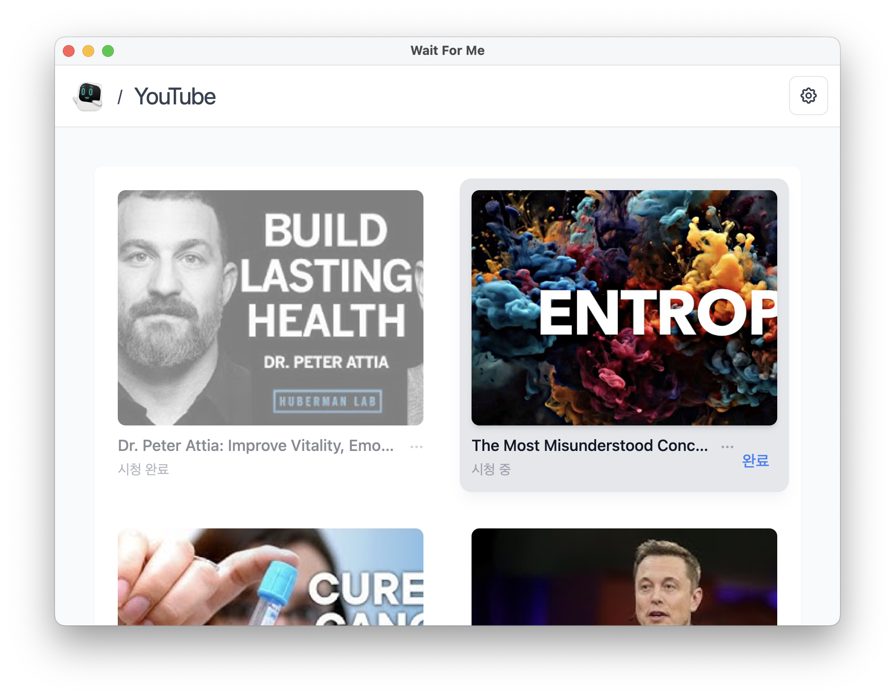

[English](./README.md) | [日本語](./README.ja.md) | [中文](./README.zh.md) | [한국어](./README.ko.md)

# Wait For Me

당신의 개인 컬렉션을 만들고 관리하세요.

🧱 _이 프로젝트는 아직 큰 개발 중에 있습니다. 앱은 많은 중요한 변화를 겪을 수 있습니다._

## 기능

- 자신만의 개인 컬렉션 만들기
- 링크와 사용자 정의 이미지 추가
- 좋아하는 쇼를 위한 시청 목록 생성

그리고 더!

## 다운로드

### Mac

### Windows

### Linux

## 스크린샷

카테고리 별로 관리

컬렉션 잠금

YouTube용 개인 시청 목록

## 🧑‍💻 다른 앱

확인해보세요:

- [Our World](https://ourworld.center/ko/apps) (공식 웹사이트)
