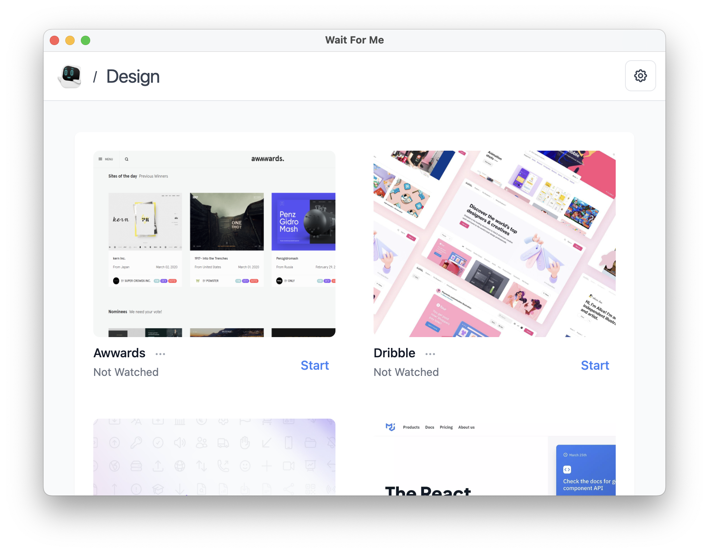
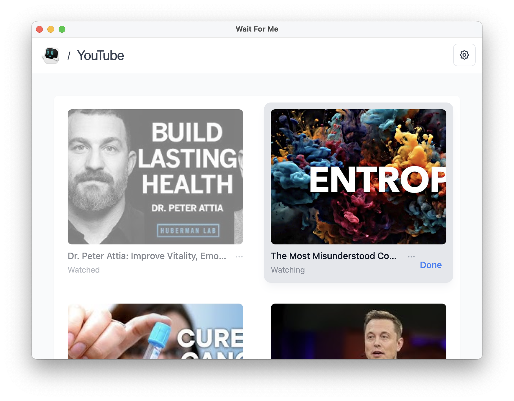

# Wait For Me

Build and manage your personal collections.

🧱 _This project is still under heavy development. The app may undergo many significant changes._

## Features

- Craft your own personal collections
- Add links and custom images
- Create a watchlist for your favorite shows

And more!

## Download

### Mac

`Coming Soon!`

### Windows

`Coming Soon!`

### Linux

`Coming Soon!`

## Screenshots

Managed under categories

Lock your collections

Personal watchlist for YouTube

## 🧑‍💻 Other Apps

Check out:

- [Our World](https://ourworld.center/apps) (Official Website)
