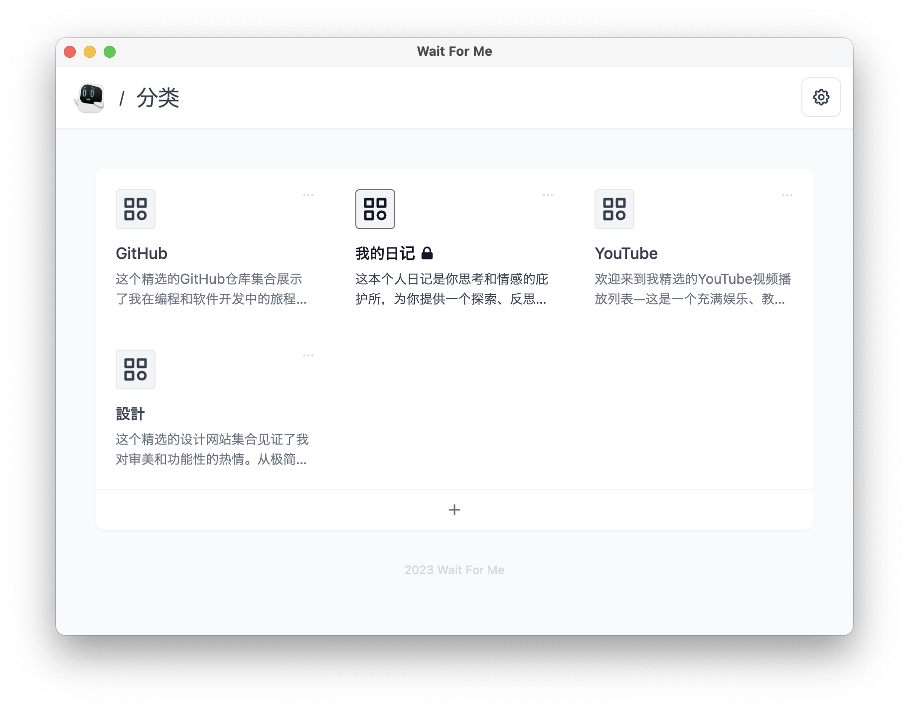
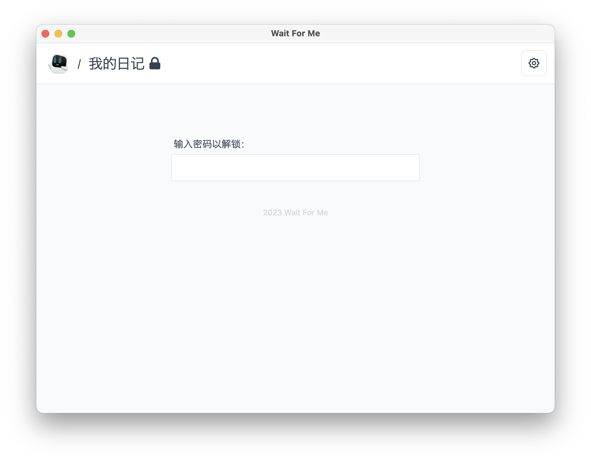

[English](./README.md) | [日本語](./README.ja.md) | [中文](./README.zh.md) | [한국어](./README.ko.md)

# Wait For Me

专属于你的个人收藏。

🧱 _此项目仍在大规模开发中。应用程序可能会经历很多重大变化。_

## 功能

- 打造自己的个人收藏
- 添加链接和自定义图片
- 为您喜欢的节目创建观看列表

还有更多！

## 下载

### Mac

### Windows

### Linux

## 截图

按分类进行管理

锁定您的收藏

个人观看列表

## 🧑‍💻 其他应用

请查看:

- [Our World](https://ourworld.center/zh/apps) (官方网站)
